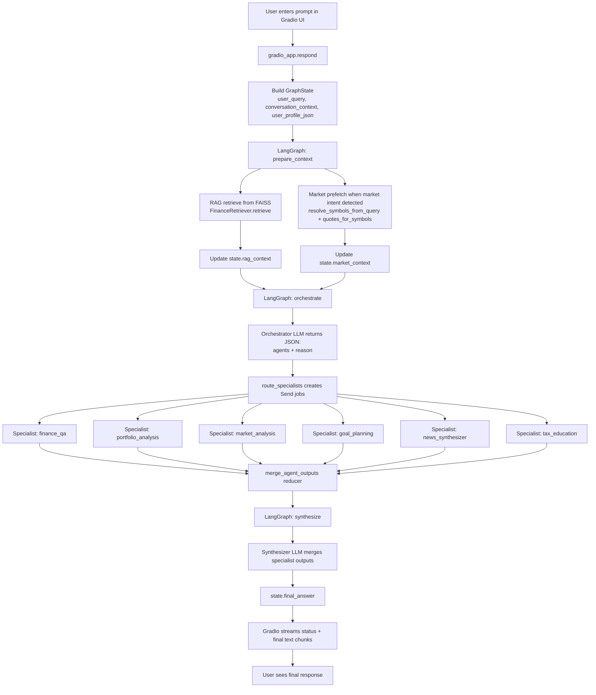
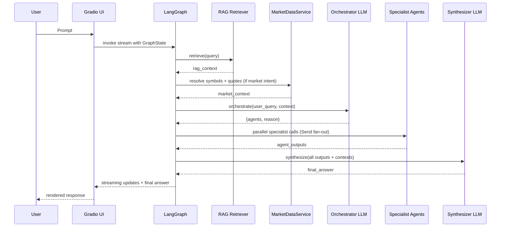

# Workflow Diagram

This document shows how a user prompt moves through the system from input to final answer.

## End-to-End Flow

## Sequence View

## Notes

- Parallelism is handled by `route_specialists` + LangGraph `Send`.
- RAG context is scoped to selected educational agents (`finance_qa`, `tax_education`, `goal_planning`).
- Market context is scoped to market-focused agents (`market_analysis`, `portfolio_analysis`).
- If a provider fails, the workflow degrades gracefully and still produces an answer when possible.
